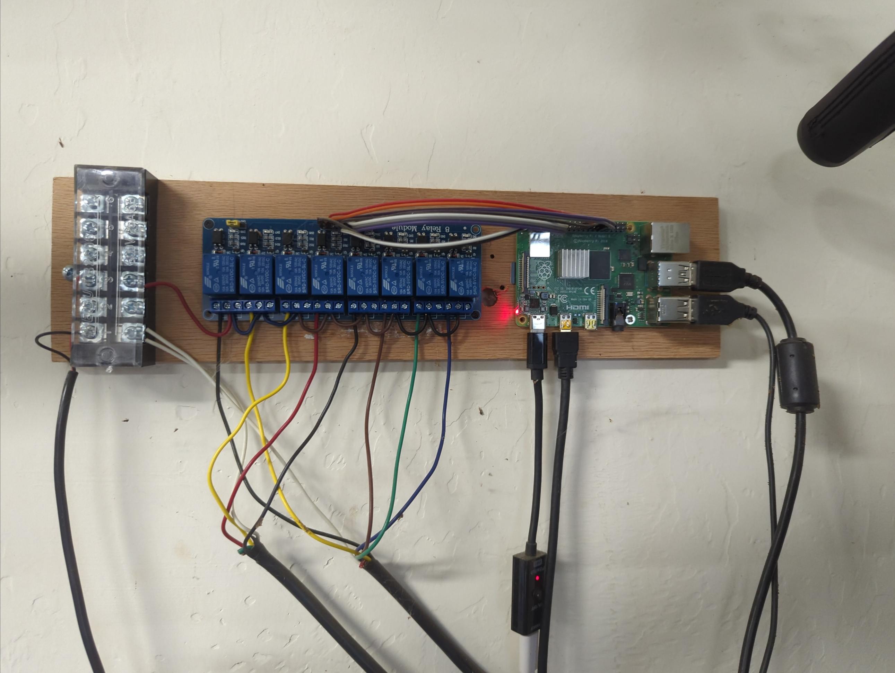
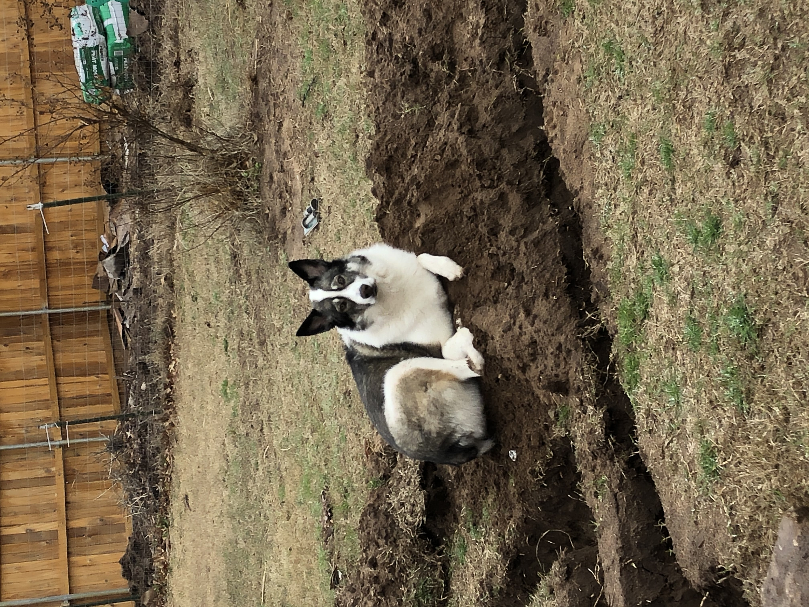

# Raspberry PI Sprinkler Controller

This project was my first foray into python programming and the rPi system.  It is a realtively simple program that allows me to control my home sprinkler system with a <b>Raspberry PI</b> using a web interface.

The sprinkler system is divided into eight 'zones'.  Each zone has a separate relay and solenoid control valve.  

The web interface is only hosted locally on my home LAN as our ISP unfortunately uses dynamic IP addressing (and I'm cheap and don't want to upgrade).

I built in a weather query via synopticdata API.  My intention was to program the sprinkler to not come on if it had rained in the past XX days, etc.  While I did get the API data pulling in from a local station, I never got around to using the weather data in the program.

Currently I can either set all zones to automatically come on in sequence for a set duration each day, or control single zones manually.

I programmed a few safety features into the system based on trial-and-error.  For instance, one time I started a zone manually and forgot about it until the next day.  Now if I start a zone manually, it will automatically shut itself off after 45 minutes.  I also set a delay time between the stopping of one zone and starting of the next during the  to minimize water hammer in the pipes.  Lastly, only one zone can operate at a time.  I implemented this by checking that the status if off (0) before allowing any zone to start.  This is to prevent excessive flow through the system which is hard on the meter and pipes.  

I'm using a SQLlite database to store values to determine which zone to use and whether or not the 'all zones' morning sequence is set to on or off.

I dug all the piping for the 8 zones by hand.  Digging gave my brain a break from the hard work of coding.   

I hope you like my project.  Here are a few images of the dirty work!  

   
